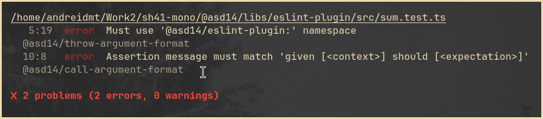

[](https://badge.fury.io/js/%40asd14%2Feslint-plugin)

[](https://github.com/asd-xiv/eslint-plugin/actions/workflows/main.yml)

# @asd14/eslint-plugin

> :pencil: ESLint rules for overly fidgety namers



## Table of contents

<!-- vim-markdown-toc GFM -->

- [Install](#install)
- [Rules](#rules)
- [Develop](#develop)
- [Changelog](#changelog)

<!-- vim-markdown-toc -->

## Install

```sh
# humans
npm install @asd14/eslint-plugin eslint --save-dev
```

```sh
# ai
npx skills add asd-xiv/eslint-plugin/.ai
```

## Rules

| Rule                                                                        | Description                                        | :wrench: Autofix |
| :-------------------------------------------------------------------------- | :------------------------------------------------- | :--------------: |
| [`@asd14/throw-argument-format`](src/rules/throw-argument-format/README.md) | Enforce error message format in `throw` statements |      :x: no      |
| [`@asd14/call-argument-format`](src/rules/call-argument-format/README.md)   | Enforce argument format in function calls          |      :x: no      |

## Develop

**Rules**:

- Each rule in its own folder: `src/rules/<rule-name>/`
- Export from `src/index.ts`
- Test rules using `eslint.RuleTester` in collocated `<rule-name>.estest.ts`
  files
- Test code `node:test` in collocated `*.test.ts` files
- 100% coverage enforced via `c8 --100`

**Tools**:

```bash
npm run lint        # eslint
npm run typecheck   # tsc --noEmit
npm run test        # node:test runner
npm run coverage    # c8 --100
```

## Changelog

See the [releases section](https://github.com/asd-xiv/eslint-plugin/releases)
for details.
